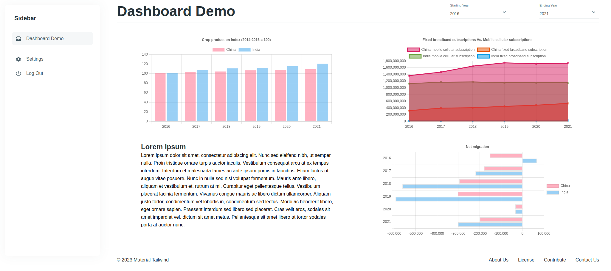

This little project is part of the demonstration for the [2023 take on dashboard]().

The objective is to have a basic NextJS dashboard with a GraphQL, some charts and testing infrastructure that might be useful in future projects



## Getting Started

This is a [Next.js](https://nextjs.org/) project bootstrapped with [`create-next-app`](https://github.com/vercel/next.js/tree/canary/packages/create-next-app).
First, run the development server:

```bash
$ npm install
$ npm run dev
```
## Learn More

To learn more about Next.js, take a look at the following resources:

- [Next.js Documentation](https://nextjs.org/docs) - learn about Next.js features and API.
- [Learn Next.js](https://nextjs.org/learn) - an interactive Next.js tutorial.

You can check out [the Next.js GitHub repository](https://github.com/vercel/next.js/) - your feedback and contributions are welcome!

## Testing

**Unit Testing**
```
$ npm test
```

**E2E Testing**

```
$ npm run e2e
```
